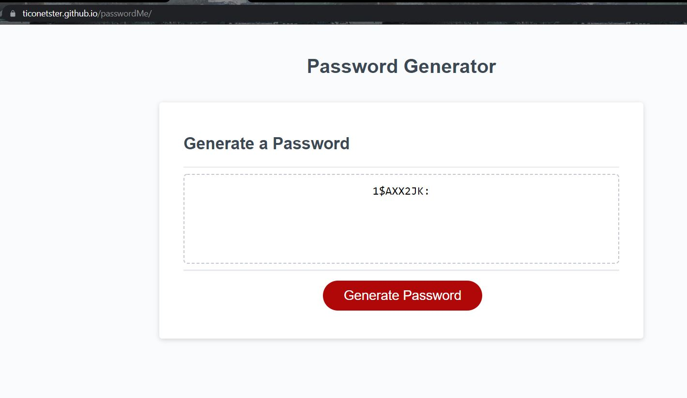

# PasswordMe

## Description

Generated an unique password with the following criteria:
Markup : 1. Length of the password has to be between 8 and 128 characters long.
         2. One of the following character types have to be used:
             1. Lowercase (abcdefghijklmnopqrstuvwxyz)
             2. Uppercase (ABCDEFGHIJKLMNOPQRSTUVWXYZ)
             3. Number (0123456789)
             4. Special character ( !"#$%&'()*+,-./:;<=>?@[\]^_`{|}~)

Once the character types are selected and the length is defined, then it displays the password generated on the page.
Below is a screenshot of the final product.

Visit the live page: [Generate me a password!](https://ticonetster.github.io/passwordMe/)
